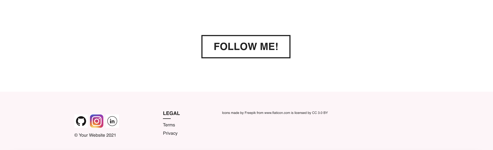

## Introduction
This application is my portfolio built with react. It shows 6 of my current repos as well links to my github, linkedin, and instagram. 

## Installation
To install this application, fork from my repo and make a clone of it. Run npm install and then npm start.

## Application
The application is hosted on Heroku, you can see it here:
https://fierce-harbor-58068.herokuapp.com/

